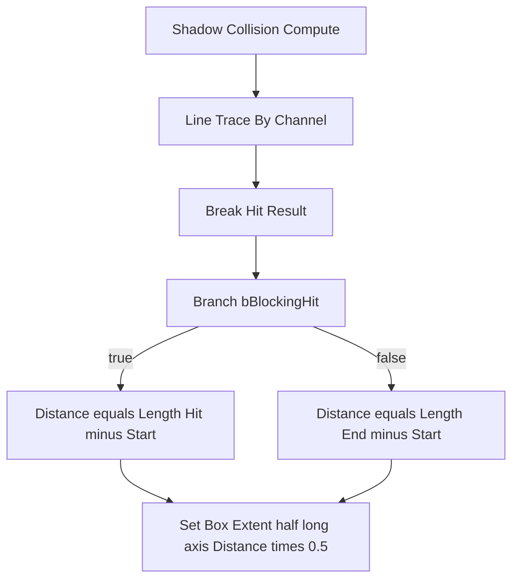

# BP_Enemy1 Shadow Logic 修改計劃（修訂版）

## 目標行為（你已確認的規格）

| 情況 | 影子 Box 沿射線的「線段長度」應等於 |
|------|-------------------------------------|
| **有 Blocking Hit**（例如打到地板） | **Trace Start → Hit 點**（地板近則**變短**） |
| **沒打到** | **Trace Start → Line Trace 的 End**（與你在射線上設定的**最長一槍**一樣長） |

白話：**長度永遠跟「這一槍實際在算的線段」一樣長**；有 Hit 終點在命中處，沒 Hit 終點在 **Trace End**。

**本計劃的修改範圍僅限**自訂事件 **`Shadow Collision Compute`** 內的接線與邏輯；**不在**其他自訂事件、`UpdateOneShadowCollider`、`ResetOneShadowCollider` 等圖裡重複實作同一套距離／Extent 公式。前提是所有會動到該影子 Box 的更新，實際上都會走到（或經由呼叫）這個事件；若之後發現別處仍在直接 `Set Box Extent` 而結果打架，那是**前提不成立**時的後續整理，不在本計劃預設工作內。

## 現況（依 repo 快照）

[graph_summary.json](graph_summary.json) 顯示 **BP_Enemy1** 內已有 **`Shadow Collision Compute`** 及相關節點（**`Line Trace By Channel`**、**`Break Hit Result`**、**`Set Box Extent`** 等）。圖裡另可見 **`UpdateOneShadowCollider`**、**`ResetOneShadowCollider`**、**`Shadow Collision 1/2/3`** 等——**僅供你對照依賴與執行順序**；**本計劃不修改那些圖**。

## UE 實作要點

1. **`Set Box Extent`** 的 **In Box Extent** 是**半徑**。線段全長 = **`Distance`** 時，長軸半徑 = **`Distance * 0.5`**。
2. **`Distance` 的兩個來源必須同一條邏輯**：
   - **True**：`Vector Length`（**`Hit.Location`（或 `Impact Point`）** − **`Start`**）— 與 **Line Trace** 的 **Start** 同一條線。
   - **False**：`Vector Length`（**`End`** − **`Start`**）— **`End` 必須與 Line Trace 節點上的 End 完全同一來源**（不要手打另一個向量）。
3. **兩分支匯流**：兩邊都算出一個 **float Distance** 後，用 **Select Float**（依 `bBlockingHit`）或兩條 exec 匯到同一顆 **Set Box Extent**，避免複製兩套旋轉／位置程式碼時只改到一邊。
4. **與舊版計劃的差異**：**未命中時不要「不寫 Extent」**；未命中時要寫成 **整段射線長**，否則盒子會卡在上一幀的長度。

## 實作步驟（在編輯器內操作）

### 1. 打開 `Shadow Collision Compute`

1. 開啟 **BP_Enemy1**。
2. 在 EventGraph 找到 **`Shadow Collision Compute`** 自訂事件節點，從它的 **`then`** 往下追 **Line Trace By Channel**。

### 2. 接上「有打／沒打」的距離選擇

1. 在 **Break Hit Result** 之後（或與 Trace **then** 同一條鏈上可讀到 Hit 處）放 **Branch**，**Condition** = **`b Blocking Hit`**（或與你專案裡 Trace 成功判定一致）。
2. **True**：**Subtract**（Hit − Start）→ **Vector Length** → 寫入區域變數或 **Select** 的 A：**`DistanceHit`**。
3. **False**：**Subtract**（**Trace End** − Start）→ **Vector Length** → **Select** 的 B：**`DistanceFull`**。
4. **Select Float**（Index 用 `bBlockingHit` 轉 0/1 或直接用布林版 Select）：輸出 **`Distance`**。

若你已有 **`Shadow colision distance`** 變數且語意就是「當前線段長」，可 **Set** 該變數 = **`Distance`**，再從該變數拉去 **×0.5**，單一數據來源較好維護。

### 3. `Set Box Extent`

1. **`Distance * 0.5`** → **Make Vector** 的**長軸**（依你盒子本地軸選 X/Y/Z）；另兩軸維持原寬厚。
2. **Set Box Extent** → Target = 對應的 **ShadowCollider**；**兩分支匯流後**只執行一次（或兩分支各執行但數值必須來自同一套 Select）。

### 4. 位置與旋轉（與「線段終點」一致）

- **線段終點**：有 Hit 用 **Hit 座標**；沒 Hit 用 **Trace End**（與 Line Trace 的 End 相同）。
- **中點**：**Start** 與「線段終點」**Lerp 0.5** → **Set World Location**（或你現用的 Relative）。
- **旋轉**：**Find Look At Rotation**（**Start** → **線段終點**）→ **Set World Rotation**。

這樣沒打到時盒子仍會沿射線拉滿到 **End**，不會只拉長度卻指向錯誤。

### 5. 與其他圖的關係（本計劃不改這裡）

- **本計劃不改** `ResetOneShadowCollider`、`Shadow Collision 1/2/3`、`UpdateOneShadowCollider`。
- 若做完 **Compute** 後行為仍怪，再另查是否 **Reset 或其他事件在 Compute 之後又寫了一次 extent**（執行順序／重複邏輯）；那屬於除錯延伸，**不是**本計劃內要動的檔位。

### 6. 驗證

1. **Compile** → **PIE**。
2. **Line Trace**：**Draw Debug Type = For Duration**，對照 **有打中**（盒子變短）與 **拉遠到沒打中**（盒子 = 整段線）兩種情況。
3. 需要 Overlap 更新時，**Set Box Extent** 勾 **bUpdateOverlaps**。

## 不在此計劃內

- 不改 C++、不改 repo 內 `ue-mcp` 腳本；僅 **Blueprint 編輯器**內、**且僅在 `Shadow Collision Compute`** 接線與預設值。
- **不在**其他事件或函式圖內複製同一套 **Distance / Set Box Extent**（除非你主動擴大範圍）。
- 若射線 **Start/End** 之後改成動態（例如跟隨多顆球），只要 **False 分支仍綁同一組 Start/End**，本規格不變。
