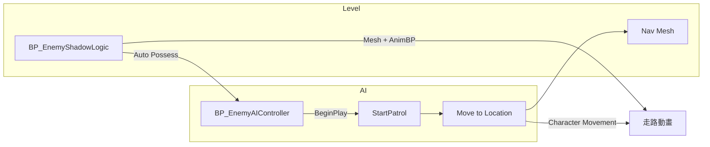

# 敵人 AI 從零開始（第一階段：會走 + 走路動畫）

> 適用：你用 **git revert** 回到較乾淨的狀態後，**只**做這份文件。  
> 目標：**按 Play 後敵人自己走向 NavMesh 上的隨機點**，腳下有 **走路動畫**。  
> **不做**：追玩家、巡邏中心 Target Point、AIPerception（第二階段再加）。

---

## 你要用到的資產（名稱請對一下）

| 資產 | 用途 |
|------|------|
| `BP_EnemyShadowLogic` | 場景裡的敵人（影子邏輯都在這，**不要**在這裡寫移動 AI） |
| `BP_EnemyAIController` | **新建**，只負責「叫角色走路」 |
| `Lvl_ThirdPerson` | 測試關卡 |
| `BP_ThirdPersonCharacter` | 參考走路動畫用（複製 AnimBP） |

若 revert 後沒有 `BP_EnemyAIController`，下面會教你新建。

---

## 第 0 步：Revert 之後先確認

1. 開 Unreal，開專案 `Light_and_Shadow`。
2. 確認 **Content/BluePrint/BP_EnemyShadowLogic** 能開、能 Compile。
3. 關卡 **Lvl_ThirdPerson** 裡還有放至少 **一隻敵人**。
4. **刪掉或不要用** 之前弄壞的 `BP_EnemyAIController`（若有）→ 下面會新建乾淨的。

**原則（很重要）：**

- **移動、Move To** → 只在 **AI Controller** 做。
- **影子、碰撞、踩人** → 留在 **BP_EnemyShadowLogic**，BeginPlay 不要接 Move To。

---

## 第 1 步：關卡 NavMesh（沒有綠網 = 永遠不走）

1. 開 **Lvl_ThirdPerson**。
2. **Place Actors** 搜尋 `Nav Mesh Bounds Volume`。
3. 拖進關卡，用 **Scale** 蓋住敵人會走的地板（比地板大一點）。
4. 上方工具列 **Build → Build Paths**（或導航相關 Build）。
5. 按鍵 **P** → 地板應出現 **綠色網格**。沒有綠網就不要繼續。

---

## 第 2 步：確認敵人是「能走路的角色」

1. 開 **BP_EnemyShadowLogic**。
2. 左側 **Components** 應有：
   - **Capsule Component**
   - **Character Movement**（或 CharacterMovement）
   - **Mesh**（Skeletal Mesh，不能是空的）
3. 點 **Mesh** → Details：
   - **Skeletal Mesh** 有指定模型（例如 Mannequin）。
   - 先記下 **Anim Class** 是不是 `None`（第 6 步會設）。
4. 點根節點 **BP_EnemyShadowLogic (Self)** → Class Settings / 父類應是 **Character**（不是普通 Actor）。
5. **Compile & Save**。

### 敵人 Class Defaults（AI 會來控制它）

仍在 **BP_EnemyShadowLogic**，點 **Class Defaults**（工具列 Class Defaults 按鈕）：

| 屬性 | 設成 |
|------|------|
| **AI Controller Class** | `BP_EnemyAIController`（第 3 步建好後再選） |
| **Auto Possess AI** | **Placed in World or Spawned** |
| **Use Controller Rotation Yaw** | 可勾選（讓轉向跟移動） |

**Character Movement**（在 Components 裡選 Character Movement）：

| 屬性 | 建議 |
|------|------|
| **Max Walk Speed** | `200`（之後 AI 也可改） |
| **Orient Rotation to Movement** | **勾選**（走路會朝移動方向轉） |

**Compile & Save**。

---

## 第 3 步：新建乾淨的 AI Controller

1. Content Browser → `Content/BluePrint/Enemy/`（沒有資料夾就建在 `BluePrint` 下）。
2. 右鍵 → **Blueprint Class** → 搜尋 **AIController** → 選 **AIController**。
3. 命名：**BP_EnemyAIController**。
4. 雙擊打開 → **Compile & Save**（先空白也可以）。

**不要**在 AI Controller 上建 `PatrolOriginActor` 變數（第一階段不需要，避免又讀錯物件）。

---

## 第 4 步：AI 的 Event Graph（遊戲開始就巡邏）

打開 **BP_EnemyAIController** → **Event Graph**。

### 4.1 拉節點（只有 2 個）

1. 已有 **Event BeginPlay**（紅色）。
2. 在空白處右鍵 → 搜尋 **Start Patrol** 若沒有函式，先做完第 5 步再回來；或暫時：
   - 右鍵 → **Add Custom Event**，命名 `StartPatrol`（**僅測試用**；正式請用第 5 步的 **Function**）。
3. 正確做法：第 5 步建立 **Function `StartPatrol`** 後，在 Event Graph：
   - 從 **Event BeginPlay** 的 **白色 then** 拖線
   - 搜尋 **Start Patrol**（Call Function，Target 會是 self）
   - 接上 **execute**

最終：

```
Event BeginPlay (then) ──白線──► Start Patrol (execute)
```

4. **Compile & Save**。

**不要**在 Event Graph 放 Cast、Move To、Get Patrol Origin（全部放 Function 裡）。

---

## 第 5 步：Function `StartPatrol`（極簡版，一定會動）

左側 **Functions** → **+** → 命名 **StartPatrol** → 打開這張圖。

下面每一條：**白線 = 執行順序**，**藍/黃線 = 資料**。

### 5.1 執行白線（由左到右）

```
[Function StartPatrol] 
    → Get Controlled Pawn 
    → Cast To BP_EnemyShadowLogic (用 then，不是 Cast Failed)
    → Get Random Reachable Point in Radius
    → Branch
    → Move to Location
```

### 5.2 節點怎麼拉

| # | 節點 | 怎麼拉 |
|---|------|--------|
| 1 | **Get Controlled Pawn** | 右鍵 → 搜尋；**Target = self**（AIController） |
| 2 | **Cast To BP_EnemyShadowLogic** | 從 Get Pawn 的 **Return Value** 接到 Cast 的 **Object**；白線：Pawn **then** → Cast **execute** |
| 3 | **Get Actor Location** | **Target** 接 Cast 的 **As BP Enemy Shadow Logic**（藍線） |
| 4 | **Get Random Reachable Point in Radius** | **Origin** ← 上一步 Location；**Radius** ← 右鍵 **Make Literal Float** 填 `600`（或 Promote to variable 名 `PatrolRadius` 設在 **敵人 BP** 上再從 Cast 讀） |
| 5 | **Branch** | **Condition** ← Random 的 **Return Value**（bool）；白線：Random 沒有 exec，上一個 Cast **then** → Branch **execute** |
| 6 | **Move to Location** | **Target** ← 右鍵 **Self**；**Dest** ← Random 的 **Random Location**；勾 **Use Pathfinding**；**Acceptance Radius** = `75`；白線：Branch **True** → Move **execute** |

### 5.3 常見錯誤（會造成不動或 ICE）

| 錯誤 | 後果 |
|------|------|
| 白線接到 **Get Actor Location** / **Is Valid** | 編譯 ICE 或邏輯壞掉 |
| **Move to Location** 的 Target 接敵人 | 應接 **Self（AIController）** |
| 沒接 Cast **then** | 後面全不跑 |
| Random **Return Value = False** 還接 Move | 不會動；False 可接 **Print String**「Random Failed」除錯 |
| 半徑 `0` | 幾乎永遠 False |

### 5.4 可選：從敵人讀速度（讓走快一點）

在 Cast **then** 之後、Random 之前插入：

1. **Get Movement Component**（Target = Cast 的敵人）
2. **Set Max Walk Speed**（Target = Movement Component，**New Max Walk Speed** = `200`）

白線串在中間即可。  
若敵人 Class Defaults 已設 Max Walk Speed，可略過。

### 5.5 Compile

- **Compile** 若出現 `CreateExecutionSchedule` → 全選 **Break All Links**，照 5.1 重拉，確認 **沒有白線進純節點**。
- **Save**。

---

## 第 6 步：走路動畫

移動由 **Character Movement** 驅動；動畫要 **Anim Blueprint** 讀速度。

### 6.1 最快做法：複製玩家的 AnimBP

1. 開 **BP_ThirdPersonCharacter** → 選 **Mesh** → Details 看 **Anim Class**（例如 `ABP_Unarmed` 或類似名稱）。
2. 在 Content Browser 找到該 **Anim Blueprint** → 右鍵 **Duplicate** → 命名 `ABP_Enemy`。
3. 開 **BP_EnemyShadowLogic** → **Mesh** → **Anim Class** = `ABP_Enemy`。
4. **重要**：敵人 **Mesh** 的 **Skeletal Mesh** 必須和玩家 **同一個 Skeleton**（例如都是 UE5 Mannequin）。不同骨架的 AnimBP 不能用。

### 6.2 若 AnimBP 打開後角色滑步 / 沒動畫

在 **ABP_Enemy** 的 **Event Graph**（AnimBP 裡）通常要有：

1. **Event Blueprint Update Animation**
2. **Try Get Pawn Owner** → Cast to **Character**
3. **Get Velocity** → **Vector Length** → 存到變數 **Speed**
4. **AnimGraph** 裡用 **Speed** 驅動 **Blend Space** 或 **状态机**（Idle / Walk）

若你是 Third Person 模板複製來的 ABP，通常已內建；只要 **Speed > 0** 就會播 Walk。

### 6.3 仍 T Pose 時檢查

| 檢查項 |  |
|--------|--|
| Mesh 有 Skeletal Mesh |  |
| Anim Class 不是 None |  |
| Play 時敵人真的在移動（不是原地播放） |  |
| **Character Movement → Movement Mode** 是 Walking |  |

---

## 第 7 步：關卡最後檢查 → Play

1. **Lvl_ThirdPerson** 有 **Nav Mesh Bounds Volume**，按 **P** 有綠網。
2. 敵人站在綠網上。
3. 敵人 **AI Controller Class** = `BP_EnemyAIController`。
4. **Auto Possess AI** = Placed in World or Spawned。
5. **Play**。

**成功：** 敵人朝某方向走，腳有走路循環。  
**失敗對照：**

| 現象 | 可能原因 |
|------|----------|
| 完全不動 | 沒 NavMesh、AI 沒 Possess、StartPatrol 沒被 Call |
| 會動但 T Pose | 沒設 Anim Class 或骨架不對 |
| 只轉不走 | Move To 有、速度 0、或卡在障礙 |
| Print Random Failed | 綠網沒蓋到、Radius 太小 |

---

## 第 8 步：到達後再走向下一點（可選，仍屬第一階段）

走一段就停，是因為只叫了一次 Move To。要持續走：

1. 在 **StartPatrol** 的 **Move to Location** 節點上勾選或找 **On Move Finished**（不同 UE 版本可能在節點 Details）。
2. 完成時再 **Call StartPatrol**（自己呼叫自己）→ 循環隨機走。

或簡單用 **Set Timer by Function Name**：每 `3` 秒 Call **StartPatrol**（除錯用，不如 On Move Finished 精準）。

---

## 架構圖（記住就不會再搞混）



---

## 第二階段以後再加（現在先不要做）

- Target Point 巡邏中心、`PatrolOriginActor`
- 看到玩家追擊、7 秒回家
- AIPerception、E_EnemyAIState

先把 **第 1～7 步** 做穩，再往下加。

---

## 最短檢查清單（可列印）

- [ ] NavMesh 綠網（P）
- [ ] `BP_EnemyAIController` 新建且乾淨
- [ ] 敵人 AI Class + Auto Possess
- [ ] 移動只在 AIC，不在敵人 Event Graph
- [ ] StartPatrol：Cast → Random → Branch True → Move To（Self）
- [ ] Mesh 有 Anim Class（複製玩家 ABP）
- [ ] Play 會走 + 有走路動畫

---

若某一步卡住，回報：**哪一步、Compile 有無錯、Output Log 有無 Random Failed、按 P 有無綠網**。
